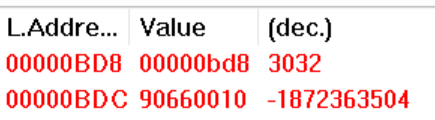

# OS Lab1

### 1.1 head.s的工作原理

- head.s首先进入内核启动代码

  - 初始化寄存器和栈。
  - 初始化新的 GDT 和 IDT（区别于boot.s里设置的虚假idt）。
  - 初始化可编程定时器 8253。
  - 初始化 TSS，加载任务0的tss。
  - 通过模拟中断返回，从内核模式切换到用户模式。

- 其中

  - 在初始化IDT时，除了填入默认中断`ignore_int`以外，还填入了选择符为0x08和0x80的`system_interrupt`中断和`timer_interrupt`中断，分别响应`int 0x80`中断和由8253计时器发送的`int 0x08`时钟中断。
  - 图

- 在任务0的用户模式下，执行task0的代码，并通过执行`int 0x80`中断打印字符A，随后执行`loop 1b`起延时作用。

  - 10ms后响应时钟中断进入`time_interrupt`中断，并在该中断内切换至任务1的`tss`。
  - 随后返回至任务1的task1代码执行。

- 在任务1的用户模式下，执行task1的代码，并通过执行`int 0x80`中断打印字符B，随后执行`loop 1b`起延时作用。并响应时间中断。

- 任务1和任务2不停切换，在屏幕上循环打印`A`和`B`字符。


### 1.2.2 head.s的内存分布状态

| 代码段           | 起始   | 终止   |
| ---------------- | ------ | ------ |
| startup_32       | 0x0    | 0xac   |
| setup_gdt        | 0xad   | 0xb4   |
| setup_idt        | 0xb5   | 0xc7   |
| rp_idt           | 0xcd   | 0xe4   |
| write_char       | 0xe5   | 0x113  |
| ignore_int       | 0x114  | 0x129  |
| time_interrupt   | 0x12a  | 0x165  |
| system_interrupt | 0x166  | 0x17c  |
| task0            | 0x10e0 | 0x10f3 |
| task1            | 0x10f4 | 0x1107 |

| **数据段**  | 起始  | 终止  |
| ----------- | ----- | ----- |
| current     | 0x17d | 0x180 |
| scr_loc     | 0x181 | 0x184 |
| lidt_opcode | 0x186 | 0x18b |
| lgdt_opcode | 0x18c | 0x191 |
| idt         | 0x198 | 0x997 |
| gdt         | 0x998 | 0x9d7 |
| ldt0        | 0xbe0 | 0xbf7 |
| ldt1        | 0xe60 | 0xe77 |
| tss0        | 0xbf8 | 0xc5f |
| tss1        | 0xe78 | 0xedf |

| 堆栈段                | 起始   | 终止   |
| --------------------- | ------ | ------ |
| init_stack(user_stk0) | 0x9d8  | 0xbd8  |
| krn_stk0              | 0xc60  | 0xe60  |
| krn_stk1              | 0xee0  | 0x10df |
| user_stk1             | 0x1108 | 0x1307 |


### 1.2.3 head.s 57-62

```assembly
	sti							#通过设置EFLAGS打开中断（之前在boot.s中关了中断）
	pushl 	$0x17				#压入ldt0中局部数据段描述符0x17
	pushl	$init_stack			#压入栈顶指针
	pushfl						#压入标志寄存器
	push	$0x0f				#压入ldt0中局部代码段描述符
	push	$task0				#压入任务0的入口地址
	iret
```

- `sti`指令

  将标志位 IF 置 1，允许中断，需要能接受时钟中断。

- 五个`push`指令
  - 模拟中断返回时栈的内容。
  - 把任务0的用户栈指针（0x17:init_stack）和代码指针 （0x0f:task0）以及标志寄存器值压入栈中，然后**执行中断返回指令 IRET**。
  - 压入数据之后的**内核栈**
  - 
  - 其中自顶向下为
    - task0的`cs:eip`（0x0f:0x10e0）
    - task0的`EFLAGS`（0x0246）
    - task0用户栈段的`ss:esp`（0x17:0x0bd8）
- 原因：
  - .因为内核启动代码特权级为0，而需要转移到的任务0代码段特权级为
  - CPU 允许低级别（如特权级 3）代码通过调用门或中断、陷阱门来调用或转移到高级别代码中运行，但反之则不行。但可以通过`iret`中段返回转移到特权级3的任务0代码段执行。
  - 
  - 主要思想是如上图所示**在堆栈中构筑中断返回指令需要的内容**，把返回地址的段选择符设置成任务 0 代码段选择符，其特权级为 3。在返回后从栈中取出**对应的段选择符**。

当初始化 GDT、IDT 和定时芯片结束后，就利用中断返回指令 IRET 来启动运行第 1 个任务。

- `iret`

  通过iret执行从高特权级到低特权级的跳转，并模拟中断返回的环境。在iret后，从栈中取出任务0对应的`cs:eip`、`eflags`、`ss:esp`。

  - 该指令会弹出**堆栈上的堆栈指针**（用户栈指针（0x17:init_stack））作为任务0用户栈指针。
  - 恢复假设的任务 0 的标志寄存器内容（pushfl的EFLAGS）。
  - 并且弹出**栈中代码指针**（代码指针 （0x0f:task0））放入 CS:EIP 寄存器中。
  - 从而开始执行任务 0 的代码，完成了从**特权级 0** 到**特权级 3** 代码的控制转移。
  - 切换后
    - 原来的内核栈变为了任务0的用户栈
    - 栈中内容变空
    - 


### 1.2.4 iret指令寻址

- `iret`前栈中的内容。（栈的地址从高到低扩展，栈顶在低地址）


- 执行iret指令时，CPU会认为是从中断中返回，因此会将**现**SS:ESP（也就是0x10:0x0BC4）所指向堆栈中的前12个字节（也就是**0x0f:0x10e0**）弹出送入CS:IP中。

- 新的CS:IP为0x000f:0x000010e0
  - 0x0f=b0000 0000 0000 1111
    - 
    - 即TI=1，RPL=3
    - 段寄存器会从LDTR（0xbe0）所指向的LDT表的段描述符1中取出段基址
    - 
  - 段描述符为0x 00c0 fa00 0000 03FF
    - 
    - 基地址为0x00000000
    - DPL为3，RPL<=DPL可以访问该段
    - 类型为执行/可读代码段。
- 得带段基地址为0x0000，加上段偏移0x10e0，则跳转至**0x10e0**处。
- 

### 1.2.5 iret指令执行前后栈的变化

 iret在恢复EFLAGS寄存器内容后，由于会进行堆栈切换。

> **iret前栈的内容**


- 在head.s57-62行，栈依次压入了任务1的局部空间代码段段选择符$0x17
  - 堆栈指针（初始堆栈指针）0xbd8
  - 标志寄存器EFLAGS
  - 任务1的局部空间数据段选择符$0x0f
  - 任务1程序入口地址0x10e0

> **iret后栈**
>
> 

可见**栈的内容被清空**了，但**栈指针所在的位置**没变。

- 变化的过程如下：

  执行iret指令时，CPU认为是从中断状态返回，会从当前栈内的内容依次取出CS:EIP\EFLAGS作为**新的CS:EIP\EFLAGS**。

  同时由于特权级发生变化，CPU接着从栈内取出SS:ESP作为**新的SS:ESP**（即用户段栈指针和选择符）。

- **堆栈的切换**

  - CPU弹出**堆栈上的堆栈指针**（用户栈指针（0x17:init_stack））作为任务0用户栈指针
    - 新的SS:ESP则为0x17:0x0bd8
      - SS为0x17=b0000 0000 0001 0111
      - TI=1，RPL=3
      - SS会从LDTR（0xbe0）所指向LDT表达段描述符2中取出段基址
      - 
        - 段描述符为0x 00C0 F200 0000 03FF
        - 基地址为0x0
        - DPL为3，RPL<=DPL可以访问该段
        - 类型为可读/写数据段
    - 得到栈段基地址为0x0000，栈指针的地址为0x0bd8
  
- **原来的内核堆栈转换为了任务0的用户堆栈**。堆栈段的段选择符和起始地址没变，但**段的内容**发生了改变。
  
  - 
  
- iret执行之后，寄存器的变化


### 1.2.6 int 0x80

**大致流程**：

- 所有中断服务程序都属于内核级别代码。
- 如果一个中断产生时任务正在用户代码 中执行，那么该中断就会引起 CPU 特权级从 3 级到 0 级的变化，此时 CPU 就会进行**用户态堆栈到内核 态堆栈**的切换操作。
- CPU 会从当前任务的任务状态段 TSS 中取得新堆栈的段选择符和偏移值。
- 因为中断服务程序在内核中，属于 0 级特权级代码，所以 48 比特的内核态堆栈指针会**从 TSS 的 ss0 和 esp0 字段** 中获得。
- 在定位了新堆栈（内核态堆栈）之后，CPU 就会首先把原用户态堆栈指针 ss 和 esp **压入内核态堆栈**，随后把标志寄存器 eflags 的内容和返回位置 cs、eip 压入内核态堆栈。

**具体过程**

执行`int 0x80`前

- %esp=0x0bd8
- ss=0x17,基地址为0x0
- 当前栈为空


执行`int 0x80`，即$system_interrupt中断时。


- int80所指门为0x 0000 EF00 0008	0166

  - 
  - DPL为3
  - 偏移为0x166
  - 为陷阱门
- 段选择符为0x0008（也就是内核代码段的选择符）
  - TI=0，RPL为0
  - 需要切换为内核模式
- 

  - DPL为3，当前CPL=3可以访问

  - 而对应的段选择符的RPL为0，可以访问int80指向的中断代码

执行`int 0x80`后

- 首先CPU会切换回内核模式，然后由于特权级别切换，CPU会从当前任务的任务状态段 TSS 0中取得新堆栈的段选择符和偏移值。即`ss0,esp0`。

- 

- 得到新的`ss:esp==0x10:0xe60`，CPU切换到新的堆栈（内核态堆栈）
  - 并把原用户态堆栈指针 ss 和 esp **压入内核态堆栈**，随后把标志寄存器 eflags 的内容和返回位置 cs、eip 压入内核态堆栈。
  - 
  - 栈中的内容依次为（栈顶在0x0E4c）
    - 0x10eb(原EIP/中断的下一条指令)
    - 0x0f原CS选择子的值
    - 0x0246为EFLAGS的值
    - 0x0bd8为原%esp的值
    - 0x17为原栈堆SS寄存器的值

  

  
