# OS Lab2

#### 2.1  system_interrupt函数执行完后iret

当执行完 `system_interrupt` 函数，执行 `153` 行 `iret` 时，记录栈的变化情况。

- `iret`前

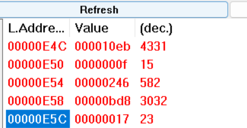

- 此时栈内为`int $0x80`前压入栈的CS:EIP/EFLAGS/SS:ESP
  - 由于是陷阱门，所以没有错误码

- `iret`时
  - 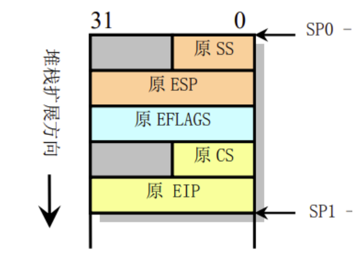
  - 类似于一开始从内核启动段转移到任务0的代码段，程序会弹出栈中的CS:EIP/EFLAGS/SS:ESP，作为新的CS:EIP/EFLAGS/SS:ESP。
  - 即转移回到任务0的代码段，且栈段也切换回任务0的用户栈段。
  - 任务0的内核栈段将清0。
- `iret`后
  - 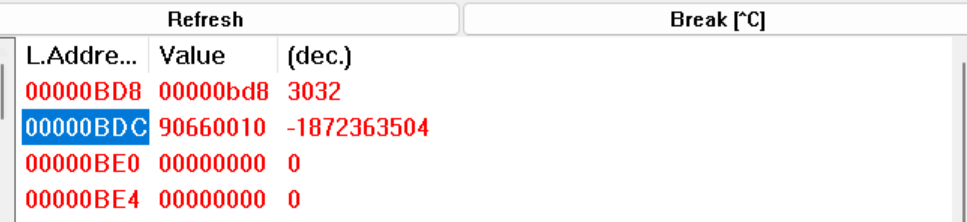
  - ss:esp指向的为**原任务0所在栈段**顶且栈为空（因为原来也是空的）
  - 发生了**栈切换**。


#### 2.2 模式切换

当进入和退出 `system_interrupt` 时，特权和栈的切换。

- 特权级的改变
  - 进入`system_interrupt`
    - 从用户模式到内核模式，特权级为3到0；
  - 离开`system_interrupt`
    - 当从内核模式到用户模式时，特权级为0到3。
- 栈的切换
  - 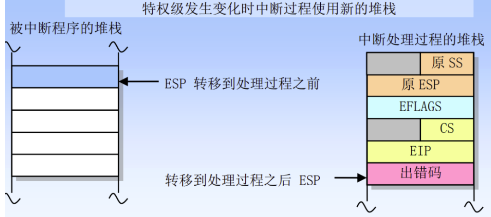
  - 进入`system_interrupt`
    - 从内核模式到用户模式，CPU会从内核栈内得到用户栈的SS:ESP进行栈切换，且原来的SS:ESP会被压入内核栈内。
    - 从任务的内核栈切换到用户栈。
  - 离开`system_interrupt`
    - 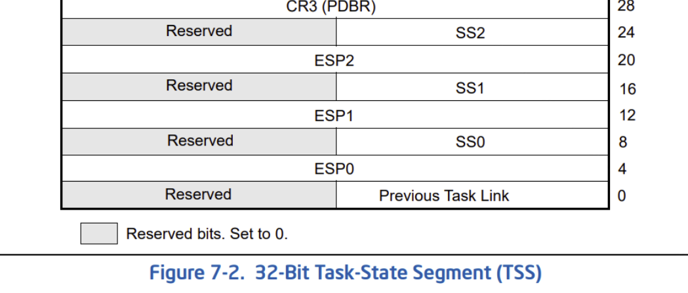
    - 从用户模式到内核模式时，CPU会从当前`tss段`内得到`ss0:esp0`（特权0）作为内核模式的栈，进行栈切换，原来的SS:ESP会被压入内核栈内。
    - 从任务的用户栈切换到内核栈。
  


#### 2.3任务切换

任务切换的过程流程图**如下**:

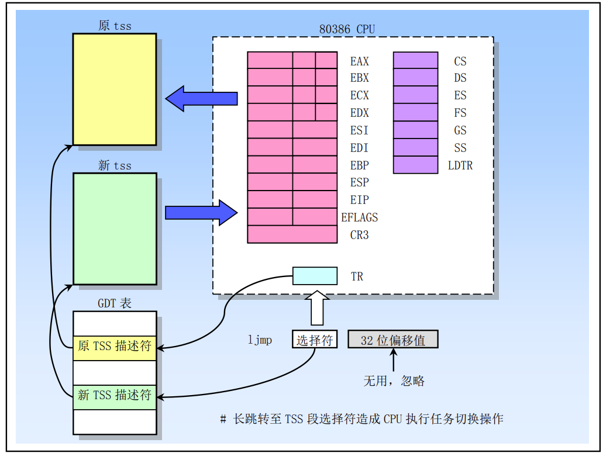

下面是任务0切换至任务1的**详细过程**：

- `time_interrupt`**内**执行的`ljmp`指令加载任务1的`tss`选择符

  - ```assembly
    		ljmp $TSS1_SEL,$0
    ```

  - 跳转的旋转符`$TSS1_SEL`为`0x30`，类型是**任务门选择符**。

  - 首先CPU利用任务门选择符`0x30`从当前的内核代码段中取出TSS1的描述符

  - 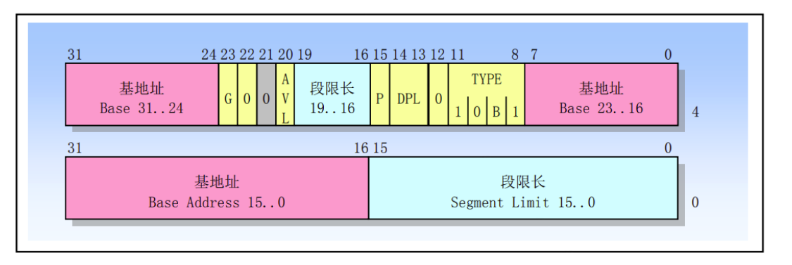

  - 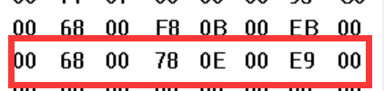

  - 特权级检查
    - DPL=0<=CPL=0，可以进行切换

  - 得到的基地址为0xE78

- `tss描述符`的变化
  - 将原tss0的B位（忙位置）置0，tss1的B位置1。
    - 前后的变化
    - 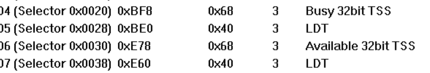
- `tss0段`的变化
  - 保存tss0的现场
  - 将切换前的所有通用寄存器、段寄存器中的段选择符、标志 寄存器 EFLAGS 以及指令指针 EIP存入tss0的任务段中，注意esp保存的是`jmpf`下一条指令`jmp 2f`的地址。
  - 切换前的tss0
  - 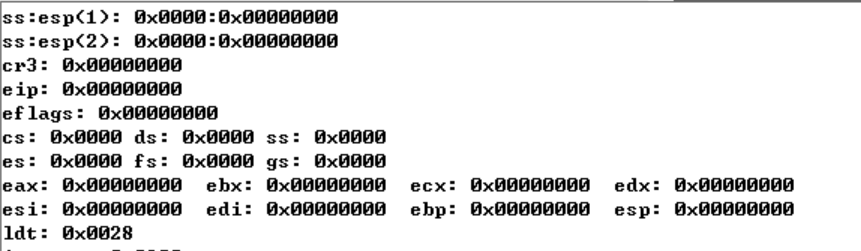
- 加载`tss1`段
  - 使用新任务 TSS 的段选择符和描述符加载任务寄存器 TR（包括隐藏部分）。
    - 切换前的`tr:0x0bf8`（tss0任务段的基地址）
    - 切换后的`tr:0x0e78`（tss1任务段的基地址）
  - 切换后的`tss段`
  - 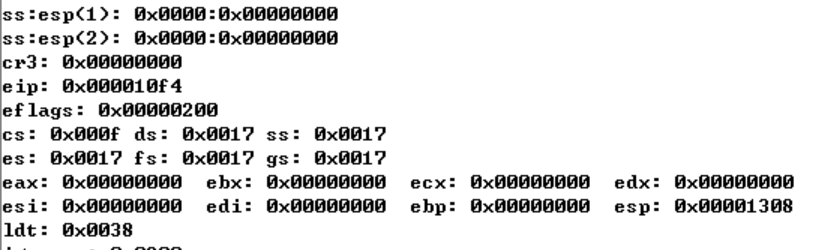
- 设置 `CR0 寄存器的 TS 标志`：表示嵌套
  - 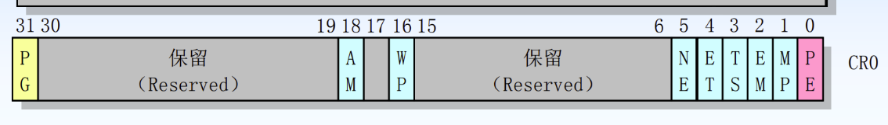
  - 切换前的`CR0:0x60000011`，TS为0
  - 切换后的`CR0:0x60000019`，TS为1
- `运行环境切换`
  - 把任务1的 `tSS1`**段内的状态加载进处理器**。
    - 包括LDTR 寄存器、PDBR（CR3）寄存器、EFLAGS 寄 存器、EIP 寄存器以及通用寄存器和段选择符。
  - `tss1`**段内的内容**
  - 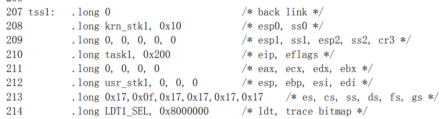
    - EFLAGS为0x200，对应NT标志位为0。
      - 当任务切换是由 JMP 指令造成，那么新任务就不会是嵌套的。也即，NT 标志会被设置为 0， 并且不使用前一任务链接字段。JMP 指令用于不希望出现嵌套的任务切换中。
    - 新的`cs:eip`为`0x0f:task0`
      - 加载后加载为task1的局部代码段和运行入口地址
    - 新的`ss:esp`为`0x17:urn_stk1`
      - 加载后栈由task0的**内核栈**切换为task1的**用户栈**
    - `LDT`切为LDT1的选择符`LDT1_SEL`
      - 加载后`ldtr`切换为task1的**局部段描述符表**
    - 其余段寄存器更新为0x17
  - 切换前的各个寄存器
  - 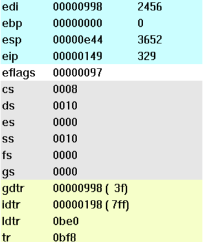
  - 切换后的各个寄存器
  - 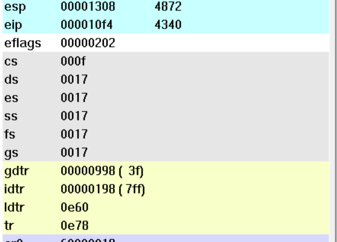
- 开始执行新任务，从新CS:EIP位置开始执行
  - 即`0x0f:0x10f4`

#### 2.4 任务1切换回任务0

任务1处于`loop 1b`指令循环，10ms后再次发生时钟中断

- 处理器响应硬件中断0x08，进入`timer_interrupt`
  - 此时发生**模式切换**，从任务1的用户模式切换回内核模式

- 此时在`timer_interrupt`内再次发生**任务切换**

> 任务**切换的流程**如下：

- 首先通过`jmpf 0x20`
  - 加载任务0的**任务段选择符**。
  - 从`gdt`表内**段选择符**指向的**段描述符**得到任务0的`tss0`段的基地址，同时进行特权级检查。
- 保护现场
  - 将当前各个寄存器的值保存至`tss1`任务段中。
- 运行环境切换
  - 从`tss0`任务段中加载上次切换前的各个寄存器值。
  - 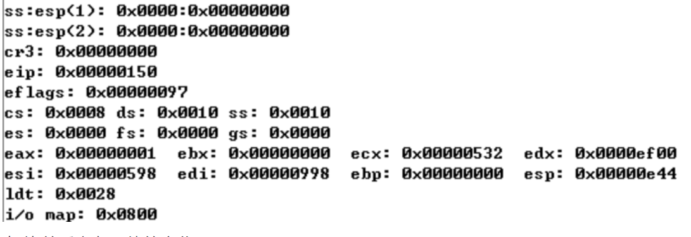
  - `cs:eip`为`0x08:0x150`，即从任务0切换至任务1时跳转指令的下一条。
    - 从任务1执行`time_interupt`处，切换至在任务0的内核模式执行`time_interupt`中断。特权级不发生改变。
  - 此时`ss:esp`为`0x10:0x0e44`，即任务0的内核栈段。
    - 从任务1的内核栈段切换至任务0的内核栈段。
    - 任务0的内核栈段内保存了，任务0执行中断前的现场
  - 其余寄存器的值也将加载为`tss0`保存的现场。

> 任务切换前后tss的变化

- 切换前：tss1任务段
- 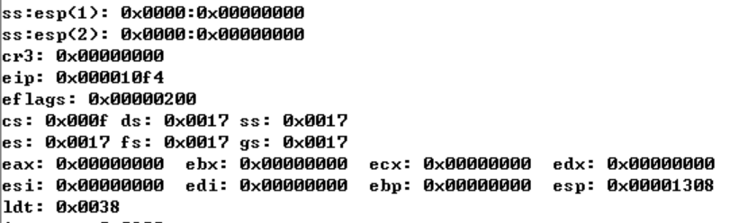
- 切换后：tss0任务段，且值与上一次任务切换时tss0保存的现场一致
- 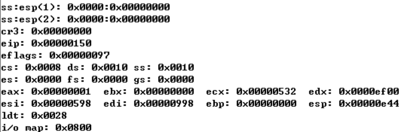

> 任务切换前后寄存器值的变化

- 红色的即为发生改变的寄存器
- 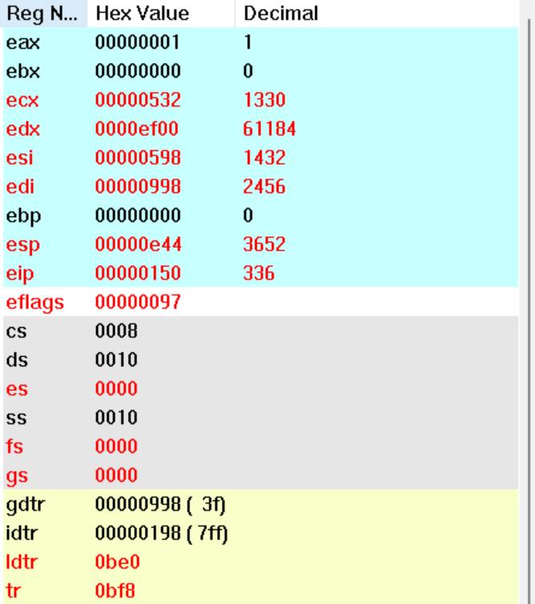
- 其中各个寄存器的值由任务0的任务段进行更新，加载为上一次切换前任务0各个寄存器的值。
- 而`CR0`的TS位被置为1，因此CR的值发生了改变。

> 切换前后TSS描述符的变化

- 切换前
- 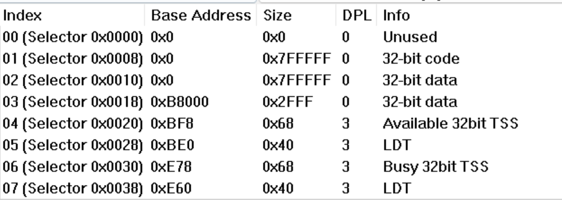
- 切换后任务1的Busy位被清0，任务0的被置1。
- 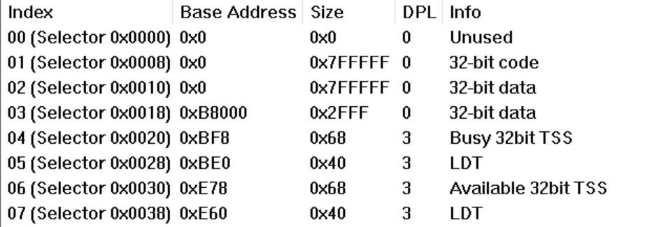

#### 2.5切换过程

执行`JMP` 指令时

- **取得新任务的 TSS 段选择符**：
  - 从作为 JMP 或 CALL 指令操作数中，或者从任务门中，或者从当前 TSS 的前一任务链接字段（对 于由 IRET 引起的任务切换）中

- **特权级检查**
  - 检查当前任务是否允许切换到新任务。
  - 如果是`jmp/call`，则当前任务的CPL和新任务段选择符的 RPL 必须小于或等于 TSS 段描述符的 DPL，或者引用的是一个任务门。
  - 无论目标任务门或 TSS 段描述符的 DPL 是何值，异常、中断（除了使用 INT n 指令产生 的中断）和 IRET 指令**都允许执行任务切换**。
  - 对于 `INT n `指令产生的中断将检查 DPL。
- **检查新任务的 TSS 描述符是标注为存在的（P=1），并且 TSS 段长度有效（大于 0x67）。**
- **段描述符的B位**
  - 如果任务切换产生自 JMP 或 IRET 指令，处理器就会把当前任务（老任务）TSS 描述符中的忙标志 B 复位；如果任务切换是由 CALL 指令、异常或中断产生，则忙标志 B 不动。
- **EFLAGS的NT位**
  - 如果任务切换由 IRET 产生，则处理器会把临时保存的 EFLAGS 映像中的 NT 标志复位；如果任务切换由 CALL、JMP 指令或者异常或中断产生，则不用改动上述 NT 标志。
- **保存现场**
  - 把当前任务的状态保存到当前任务的 TSS 中。处理器会从任务寄存器中取得当前任务 TSS 的基地 址，并且把以下寄存器内容复制到当前 TSS 中：**所有通用寄存器、段寄存器中的段选择符、标志 寄存器 EFLAGS 以及指令指针 EIP**。
- **任务寄存器TR和CR0的任务嵌套标志位**
  - 使用新任务 TSS 的段选择符和描述符加载任务寄存器 TR（包括隐藏部分）。设置 CR0 寄存器的 TS 标志。
- **加载新状态**
  - 把新任务的 TSS 状态加载进处理器。这包括 LDTR 寄存器、PDBR（CR3）寄存器、EFLAGS 寄 存器、EIP 寄存器以及通用寄存器和段选择符。在此期间检测到的任何错误都将出现在新任务的 上下文中。
- **开始执行新任务**（对于异常处理过程，新任务的第一条指令显现出还没有执行）。


