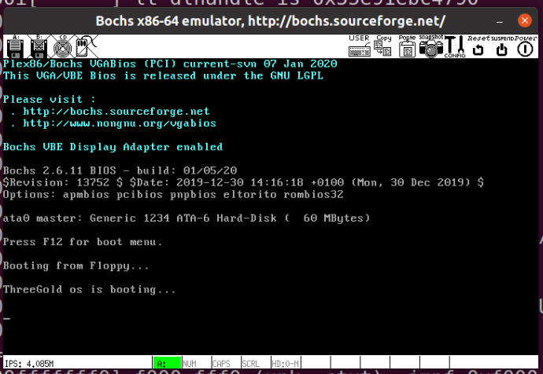
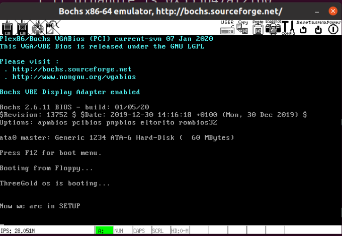
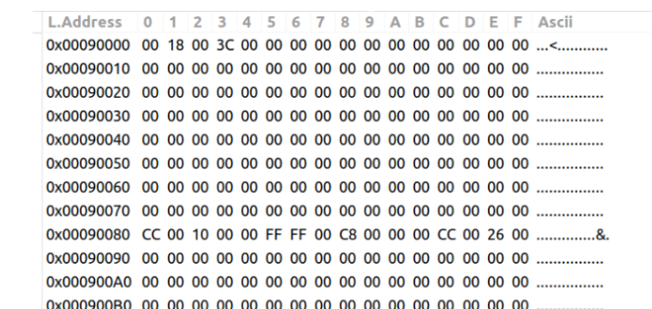
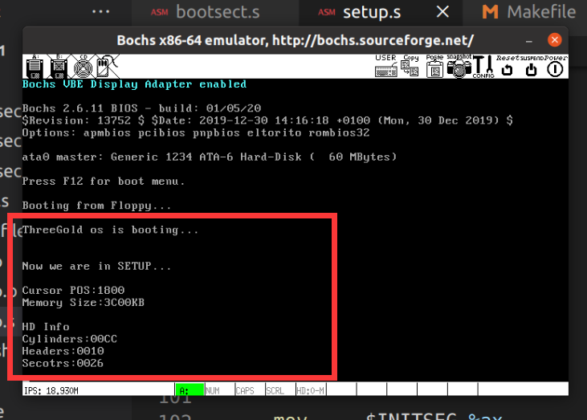

# OSLab3

> **实验环境**

- 新版oslab+build.sh+gnu as

> **回答问题**

有时，继承传统意味着别手蹩脚。 `x86` 计算机为了向下兼容，导致启动过程比较复杂。 请找出 `x86` 计算机启动过程中，被硬件强制，软件必须遵守的两个“多此一举”的步骤（多找几个也无妨），说说它们为什么多此一举，并设计更简洁的替代方案。

1）BIOS初始化时，会在物理内存开始处放置大小位1KB的中断向量表，供BIOS的中断使用。这就强制了操作系统的引导程序在加载操作系统的主模块时如果要利用BIOS中断获取一些信息，则主模块的加载位置不能将BIOS的向量表覆盖掉，而操作系统的主模块一般运行时要在内存的开始处（这样主模块中的代码地址也就等于实际的物理地址，便于操作），所以操作系统的引导程序会先将主模块（如Linux0.11中的System模块）读到内存中不与BIOS中断向量表冲突的位置，之后在将主模块移动到内存起始处，将BIOS的中断向量表覆盖掉，这是“多此一举”的。

- 解决方案是BIOS初始化时将BIOS的中断向量表放到内存中其他实模式下BIOS可以访问到的内存处，这样操作系统引导程序就可以直接将操作系统的主模块读到内存的起始处了。

2）PC机加电后，执行BIOS中的代码时，由于BIOS可访问的内存有限，则操作系统最开始的引导程序（如Linux0.11中的bootsect模块）会被读到内存绝对地址0x7C00处开始执行。执行时它会自己把自己移到内存中相对靠后的位置，以便加载系统主模块。这步是“多此一举”的。

- 解决方案是在保证可靠性的前提下尽量扩大BIOS的可访问的内存的范围，免去这不必要的移动。


#### 3.1 bootsect屏幕输出

##### 3.1.1 代码

- 在原bootsect.s上进行修改，删除无关代码，保留打印字符串的关键代码段。

- 将`.msg1`的信息修改为自己的信息`"ThreeGold os is booting..."`
- 因为不再使用`root_dev`字段，因此将该字段删除。
  - 同时需要将`boot_flag`字段前的`.org`字段改为`510`，确保有效引导扇区的标志在最后两个字节中。

```assembly
msg1:
	.byte 13,10
	.ascii "ThreeGold os is booting..."
	.byte 13,10,13,10

	.org 510
boot_flag:
	.word 0xAA55
```

- 修改打印字符的代码段
  - 将指示打印字符数的寄存器%cx赋值语句中的立即数改为`$32`
  - 在最后加上循环语句以不断显示字符串

```assembly
	mov	$0x03, %ah		# read cursor pos
	xor	%bh, %bh
	int	$0x10
	
	mov	$32, %cx
	mov	$0x0007, %bx		# page 0, attribute 7 (normal)
	#lea	msg1, %bp
	mov     $msg1, %bp
	mov	$0x1301, %ax		# write string, move cursor
	int	$0x10
inf_loop:
    jmp    inf_loop
```

##### 3.1.2 链接与执行

- 由于新的oslab/linux-0.11/boot文件夹的makefile内可以直接汇编和链接代码文件

```makefile
include ../Makefile.header

LDFLAGS	+= -Ttext 0

all: bootsect setup

bootsect: bootsect.s
	@$(AS) -o bootsect.o bootsect.s
	@$(LD) $(LDFLAGS) -o bootsect bootsect.o
	@$(OBJCOPY) -R .pdr -R .comment -R.note -S -O binary bootsect


setup: setup.s
	@$(AS) -o setup.o setup.s
	@$(LD) $(LDFLAGS) -o setup setup.o
	@$(OBJCOPY) -R .pdr -R .comment -R.note -S -O binary setup

head.o: head.s
	@$(AS) -o head.o head.s

clean:
	@rm -f bootsect bootsect.o setup setup.o head.o
```

- 所以只需执行下面这句指令即可得到执行文件

```shell
make bootsect
```

- 将得到的执行文件bootsect改名为Image，放入linux-0.11文件夹下。	

- 在oslab文件夹下执行`./dbg-bochs`，得到输出结果




#### 3.2 bootsect.s 读入 setup.s

##### 3.2.1代码修改

- 修改bootsetc.s

  - 将原bootsect.s内的`load_setup`段放在打印`ThreeGold...`字符串后面；

  - 在加载setup到内存之后，跳转至setup的起始地址处

  - ```assembly
    load_setup:
    	mov	$0x0000, %dx		# drive 0, head 0
    	mov	$0x0002, %cx		# sector 2, track 0
    	mov	$0x0200, %bx		# address = 512, in INITSEG
    	.equ    AX, 0x0200+SETUPLEN
    	mov     $AX, %ax		# service 2, nr of sectors
    	int	$0x13			# read it
    	jnc	ok_load_setup		# ok - continue
    	mov	$0x0000, %dx
    	mov	$0x0000, %ax		# reset the diskette
    	int	$0x13
    	jmp	load_setup
    
    ok_load_setup:
    	ljmp	$SETUPSEG, $0
    ```

  - 修改全局变量的值

    - 因为新的代码没有将bootsect加载到0x90000处，因此将setup的起始地址改为0x7e00(0x7c00+0x200)。
    - 将读入的setup的扇区数改为2。

  - ```assembly
    	.equ SETUPLEN, 2		# nr of setup-sectors
    	.equ BOOTSEG, 0x07c0		# original address of boot-sector
    	.equ SETUPSEG, 0x07e0		# setup starts here
    ```

- 修改setup.s

  - 将bootsect.s修改前的代码复制。

  - 将给各寄存器赋值时的值改为setup的起始地址。

  - 将打印的内容改为"Now we are in SETUP"并修改相应赋值语句

  - 删除启动盘标志

  - ```assembly
    _start:
    	mov	$SETUPSEG, %ax
    	mov	%ax, %ds	
    	mov	%ax, %es
    	mov	$0x03, %ah		# read cursor pos
    	xor	%bh, %bh
    	int	$0x10
    	mov	$25, %cx
    	mov	$0x0007, %bx		# page 0, attribute 7 (normal)
    	#lea	msg1, %bp
    	mov     $msg2, %bp
    	mov	$0x1301, %ax		# write string, move cursor
    	int	$0x10
    inf_loop:
        jmp    inf_loop  
    
    msg2:
    	.byte 13,10
    	.ascii "Now we are in SETUP"
    	.byte 13,10,13,10
    ```

##### 3.2.2 链接和执行

- 在新版OSlab linux-0.11文件夹下的Makefile内增加

  - ```makefile
    BootImage: boot/bootsect boot/setup
    	@tools/build.sh boot/bootsect boot/setup none Image $(ROOT_DEV)
    	@sync
    ```

- 修改build.sh

  - 在检查到system为none时不执行任何操作

  - ```makefile
    # Write system(< SYS_SIZE) to stdout
    [ ! -f "$system" ] && echo "there is no system binary file there" 
    ```

- 执行

  - ```shell
    make BootImage
    ```

- 在oslab文件夹下执行`./dbg-bochs`

- 


#### 3.3 setup.s 获取基本硬件参数

##### 3.3.1 获取基本硬件参数

```assembly
load_hd:
	mov	$INITSEG, %ax	# this is done in bootsect already, but...
	mov	%ax, %ds
	mov	$0x03, %ah	# read cursor pos
	xor	%bh, %bh
	int	$0x10		# save it in known place, con_init fetches
	mov	%dx, %ds:0	# it from 0x90000.
# Get memory size (extended mem, kB)

	mov	$0x88, %ah 
	int	$0x15
	mov	%ax, %ds:2

# Get hd0 data
	mov	$0x0000, %ax
	mov	%ax, %ds
	lds	%ds:4*0x41, %si
	mov	$INITSEG, %ax
	mov	%ax, %es
	mov	$0x0080, %di
	mov	$0x10, %cx
	rep
	movsb
```

- 获得的光标和内存参数存在0x90000
- 获得的硬盘hd1参数存在0x90080



##### 3.3.2 打印参数

- 打印数字的函数(用%ax传递参数)

```assembly
print_hex:
    mov    $4,%cx         # 4个十六进制数字
    mov    %ax,%dx       # %ax传递参数
print_digit:
    rol    $4,%dx         # 循环以使低4比特用上 !! 取dx的高4比特移到低4比特处。
    mov    $0xe0f, %ax    # ah = 请求的功能值，al = 半字节(4个比特)掩码。
    and    %dl,%al         # 取dl的低4比特值。
    add    $0x30,%al      # 给al数字加上十六进制0x30
    cmp    $0x3a,%al
    jl     outp          #是一个不大于十的数字
    add    $0x07,%al      # 是a～f，要多加7
outp:
    int    $0x10
    loop   print_digit
    ret
print_nl:
    mov    $0xe0d,%ax   # CR
    int    $0x10
    mov    $0xa,%al     # LF
    int    $0x10
    ret
```

- 打印字符的函数，借用打印`msg`的代码

```assembly
mov 	$INITSEG,%ax
	mov		%ax,%ds
	mov 	$SETUPSEG, %ax
	mov		%ax,%es
	mov    	$0x03,%ah
	xor	   	%bh, %bh
	int  	$0x10
	mov  	$11,%cx
	mov		$0x0007, %bx		# page 0, attribute 7 (normal)
	#lea	msg1, %bp
	mov     $cur, %bp
	mov		$0x1301, %ax		# write string, move cursor
	int		$0x10
```

- 准备的信息

```assembly
cur:
	.ascii "Cursor POS:"

mem:
	.ascii "Memory Size:"
kb:
	.ascii "KB"
hd_info:
	.byte 13,10
	.ascii "HD Info"
	.byte 13,10
	.ascii "Cylinders:"
hd_info1:
    .ascii "Headers:"
hd_info2:
    .ascii "Secotrs:"
```

- 打印时，通过`%ds:偏移`赋值给`%ax`

```assembly
mov 	%ds:0,%ax
call	print_hex
call	print_nl
```

- 最后结果


