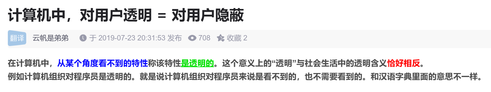

# 操作系统期末

[《操作系统精髓与设计原理第五版》习题答案.docx (book118.com)](https://max.book118.com/html/2017/0704/120156828.shtm)

[(153条消息) 操作系统恐龙书第九版课后答案（持续更新）_小龙凤团茶的博客-CSDN博客](https://blog.csdn.net/s2765504026/article/details/123389522)

