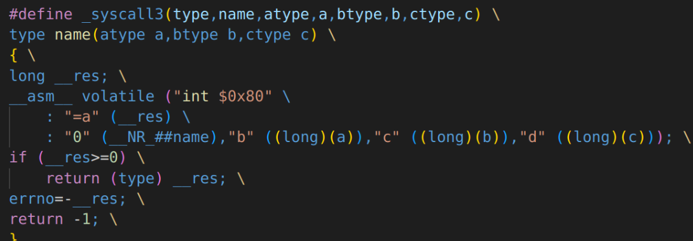
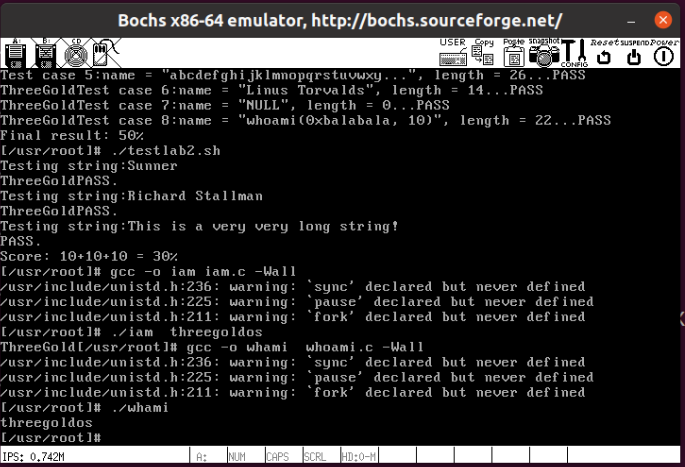
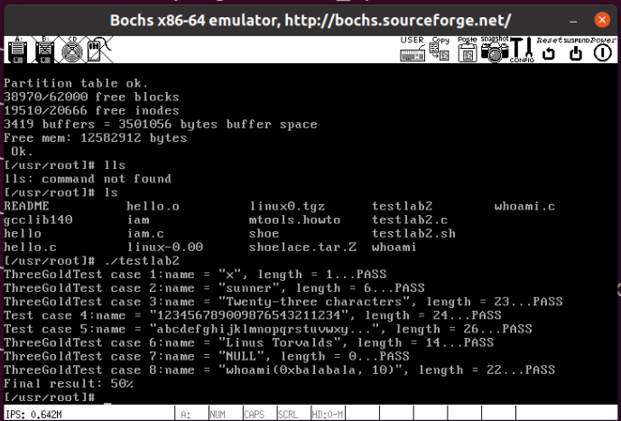
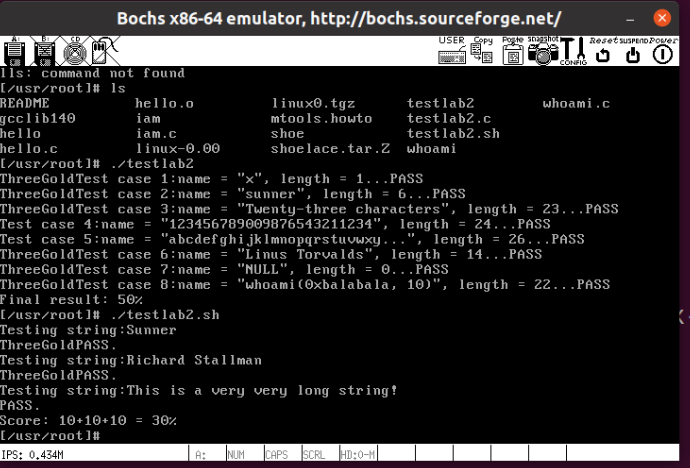
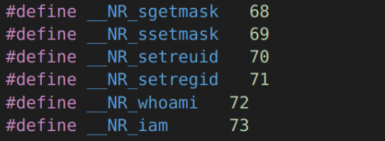
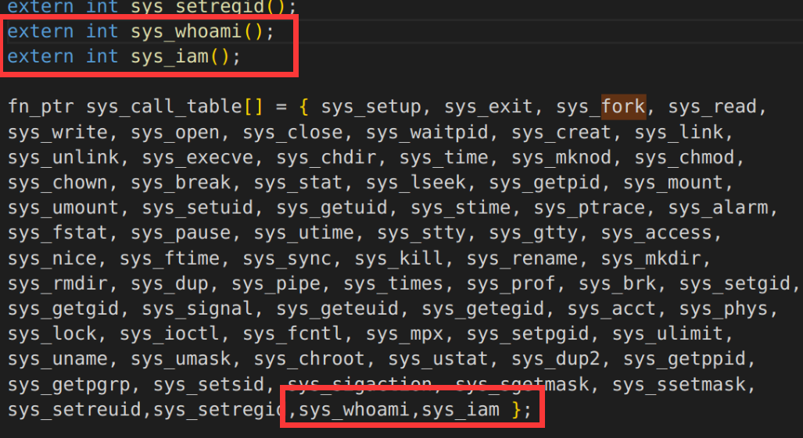
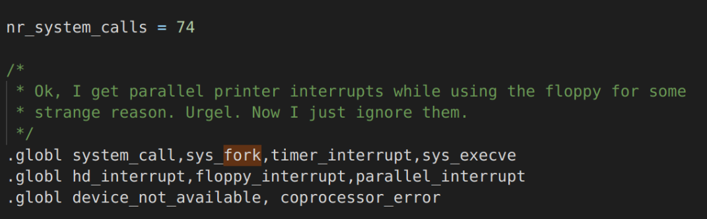
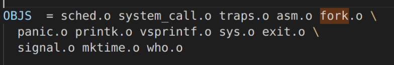
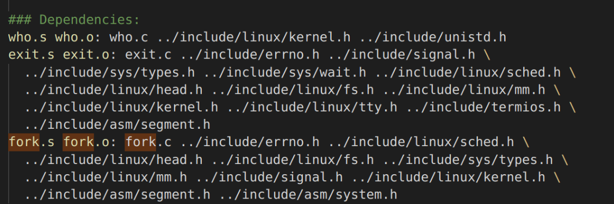

# Lab4 Reports

#### 回答问题

- 从 `Linux 0.11` 现在的机制看，它的系统调用最多能传递几个参数？

​	最多能传递**三个参数**。



​	从`_syscall3(type,name,atype,a,btype,b,ctype,c)`可看出。

​	Linux-0.11的系统调用通过寄存器ebx、ecx、edx传递参数，最多能传递3个参数。

- 你能想出办法来扩大这个限制吗？

​	利用另外三个通用寄存器edx、esi和edi传递参数，增加`_syscall4`、`_syscall5`、`_syscall6`

- 用文字简要描述向 `Linux 0.11` 添加一个系统调用 `foo()` 的步骤。

1. 在foo.c文件内实现sys_foo()系统调用函数
2. 在unistd.h中添加系统调用号
3. 在system_call.s中修改总的系统调用数
4. 在sys.h添加调用

#### 实验结果

**threegoldos**



**testlab2.c**



**testlab2.sh**



#### 实验过程

**在who.c实现sys_iam和sys_whoami**

```c
#include <unistd.h>
#include <errno.h>
#include <linux/sched.h>
#include <linux/tty.h>
#include <linux/kernel.h>
#include <asm/segment.h>
#include <sys/times.h>
#include <sys/utsname.h>
#include <string.h>

char msg[24];
int len=0;

int sys_iam(const char * name){
    int c=0;
    char temp[24];
    for(c=0;c<=23;c++){
        temp[c]=get_fs_byte(name+c);
        if(temp[c]=='\0'){
            break;
        }
    }
    if(c>=24 && temp[c-1]!='\0'){
        return -(EINVAL);
    }
    len=c;
    strcpy(msg,temp);
    printk("ThreeGold");
    return c;
}

int sys_whoami(char* name, unsigned int size){
    if(len>size){
        return -(EINVAL);
    }
    int c=0;
    for(c=0;c<=len-1;c++){
        put_fs_byte(msg[c],name+c);
    }
    return len;

}
```

**在unistd.h内增加__NR_iam和__NR_whoami**



**修改sys.h内的sys_call_table[]**



**修改system_call.s内的系统调用数**



**修改MakeFile将who.c加入编译**





**编写iam.c和whoami.c测试程序**

- iam.c

```c
#define __LIBRARY__ 
#include <unistd.h>
#include <stdio.h>
_syscall1(int, iam, const char*, name);
int main(int argc,char ** argv)
{
	int c = 0;
	if(argc<1)
	{
		printf("without name!\n");
		return -1;
	}
	c = iam(argv[1]);
	return c;
}
```

- whoami.c

```c
#define __LIBRARY__
#include <unistd.h>
#include<string.h>
#include<stdio.h>
_syscall2(int, whoami,char*,name,unsigned int,size);

int main()
{
	char msg[24];
	int c = 0;
	c = whoami(msg,24);
	printf("%s\n",msg);
	return c;
}
```

**移动测试文件至hdc内，并进行测试**

- **结果见上**