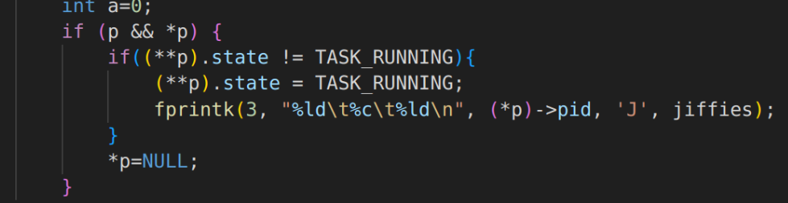

# OS Lab5

#### 问题回答

**结合自己的体会，谈谈从程序设计者的角度看，单进程编程和多进程编程最大的区别是什么？**

- 单进程是一个进程按设计好的流程**从上到下顺序执行**，数据是同步的；而多进程是多个进程同时执行的，是并行的（实际上是高速切换着运行这多个进程）。
- 虽然共享文件，但是由于多个进程之间**执行顺序无法得知**，故而要考虑进程之间的关系和影响，尤其是数据异步，程序员要做好**进程之间的同步，通信，互斥**等。相比较而言，多进程编程比单进程编程复杂得多，但是用途广泛得多。

**你是如何修改时间片的？仅针对样本程序建立的进程，在修改时间片前后， `log` 文件的统计结果（不包括Graphic）都是什么样？结合你的修改分析一下为什么会这样变化，或者为什么没变化？**

- 时间片修改：

  - 由于时间片的初始化操作为：
    **p->counter = p->priority**
  - 通过在`include/linux/sched.h`中修改`#define INIT_TASK`宏定义中priority数值实现。

- 修改时间片为：10/15/20

  - `priority=10`

  

  - `prority=15`

  

  - `priority=20`

  

- 变化的原因：
  - 时间片变小，进程因时间片到时产生的进程调度次数变多，该进程等待时间越长。
  - 然而随着时间片增大，进程因中断或者睡眠进入的进程调度次数也增多，等待时间随之变长。
  - 需设置合理的时间片，既不能过大，也不能过小。

#### 实验过程

**process.c编写**

- 利用fork()和wait()实现了15个进程的创建、并行运行和结束。

```c
#include <stdio.h>
#include <unistd.h>
#include <time.h>
#include <sys/times.h>
#include<sys/wait.h>
#define HZ	100

void cpuio_bound(int last, int cpu_time, int io_time);

int main(int argc, char * argv[])
{
	if(!fork()){
        printf( "fork1:i am  child [%d] and my parent is [%d]\n",getpid(),getppid());
        cpuio_bound(1, 1, 0);
    }
    if(!fork()){
        printf( "fork2:i am  child [%d] and my parent is [%d]\n",getpid(),getppid());
        cpuio_bound(1, 0, 1);
    } 
    if(!fork()){
        printf( "fork3:i am  child [%d] and my parent is [%d]\n",getpid(),getppid());
        cpuio_bound(1, 0, 1);
    } 
    if(!fork()){
        printf( "fork4:i am  child [%d] and my parent is [%d]\n",getpid(),getppid());
        cpuio_bound(1, 0, 1);
    }     
    
    wait(NULL);
    wait(NULL);
    wait(NULL);
    wait(NULL);    
    return 0;
}
/*
 * 此函数按照参数占用CPU和I/O时间
 * last: 函数实际占用CPU和I/O的总时间，不含在就绪队列中的时间，>=0是必须的
 * cpu_time: 一次连续占用CPU的时间，>=0是必须的
 * io_time: 一次I/O消耗的时间，>=0是必须的
 * 如果last > cpu_time + io_time，则往复多次占用CPU和I/O
 * 所有时间的单位为秒
 */
void cpuio_bound(int last, int cpu_time, int io_time)
{
	struct tms start_time, current_time;
	clock_t utime, stime;
	int sleep_time;
	while (last > 0)
	{
		/* CPU Burst */
		times(&start_time);
		/* 其实只有t.tms_utime才是真正的CPU时间。但我们是在模拟一个
		 * 只在用户状态运行的CPU大户，就像“for(;;);”。所以把t.tms_stime
		 * 加上很合理。*/
		do
		{
			times(&current_time);
			utime = current_time.tms_utime - start_time.tms_utime;
			stime = current_time.tms_stime - start_time.tms_stime;
		} while ( ( (utime + stime) / HZ )  < cpu_time );
		last -= cpu_time;

		if (last <= 0 )
			break;

		/* IO Burst */
		/* 用sleep(1)模拟1秒钟的I/O操作 */
		sleep_time=0;
		while (sleep_time < io_time)
		{
			sleep(1);
			sleep_time++;
		}
		last -= sleep_time;
	}
}
```

- 运行记录


**日志文件的建立**

- 因为采用了新版环境，所以在`init()`新增`open()`创建并打开process.log文件


**向日志文件输出信息**

- 在`/kernel/printk.c`内增加fprintk()函数，并在`/include/linux/kerner.h`内声明


**在进程切换处插入输出代码**

- **进程的开始**
  - 在`copy_process`内


- ##### **进入睡眠态的时间**

  - 在`sched.c`内的`sleep_on()`和`interruptible_sleep_on()`


- ##### **schedule()内**


- **wake_up()**



- **exit.c内**


- 结果：输出了`N\J\R\W\E`五个状态


- 补充：由于模拟器版本高，会导致缓冲那里读写有问题。出现了重复打印的情况。因此我采取在windows环境下**降低`bochs`至2.4.6版本**的方法**解决了重复打印**的问题。


**调度算法修改**

通过在`include/linux/sched.h`中修改`#define INIT_TASK`宏定义中counter和priority数值实现

- `priority=10`


- `prority=15`


- `priority=20`


- 可以看到
  - 时间片变小，进程因时间片到时产生的进程调度次数变多，该进程等待时间越长。
  - 然而随着时间片增大，进程因中断或者睡眠进入的进程调度次数也增多，等待时间随之变长。
  - 需设置合理的时间片，既不能过大，也不能过小。