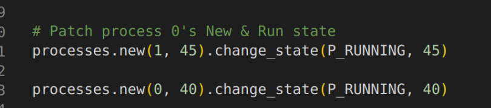

# Hit-OSLab

#### GJ-OS lab1-5教程

> 实验环境

- lgj的20版新环境下进行

> 参考博客（搜索哈工大操作系统实验即可，备注lgj的实验3-8对应lzj的实验1-5）

[(179条消息) 哈工大操作系统 实验楼实验三 系统调用_哈工大操作系统实验3_MysticalDream的博客-CSDN博客](https://blog.csdn.net/m0_52440465/article/details/128264432)

.....

> 新版环境注意事项注意

**实验3中**

- 新环境里的Makefile没有BootImage的选项，可以参考087-lab3里的Makefile修改

**实验5中**

- 在增加`process.log`的文件描述符时，放置在main()中会有`kernel panic`，需要放置在init()中。

  - 为避免stage.py出错，需要在stat_log.py中新增一句代码

    

  - 或者参照某大佬群友的意见

    1.在进程1创立时保存jiffles;

    2.在进程2前打印出来。

- 如果出现重复打印的情况，是因为

  

  - 在win或linux下安装bochs 2.4.*即可解决。（属鼠比较懒且拉，所以在win下安装）

    1.去bochs官网下载2.4.6版本的Bochs并安装；

    2.把linux oslab里面的hdc文件夹和hdc-0.11.img，linux-0.11、bochs文件夹移动到安装的bochs文件夹下；

    3.编辑bochs文件夹里面bxrc配置文件的相关路径；

    4.在bochs文件夹下运行bochs -q -f ./bochs/linux-0.11.bxrc即可
